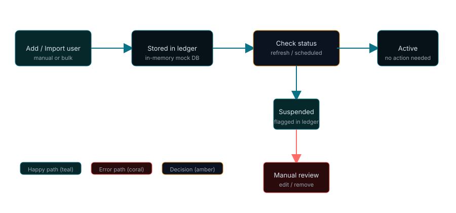

<p align="center">
  
</p>

<p align="center">
  <!-- badges: version, license, build status, language, test coverage -->
  
  
  
</p>

One-sentence hook: A tiny, browser-first ledger for tracking whether Reddit accounts are suspended — lightweight, no backend required.

## What even is this?

ModLedger is a simple static web app (single HTML page with vanilla CSS and JavaScript) that lets moderators keep a local ledger of Reddit accounts and their suspend status. It stores data locally in your browser, provides real-time checks using the Reddit API, a compact ledger view, and CSV export.

## Why does this exist?

Because sometimes you want a small, dependency-free tool to track user status offline without a database, build pipeline, or the complexity of hosting a full service. Fast to open, fast to use.

## Features

- Track Reddit usernames with reason, notes, and quick status badges.
- Manual add and bulk import (one per line / CSV-style).
- Check/refresh status in real-time via the official Reddit API.
- View status history per user in a drawer.
- Export filtered results to CSV.
- AMOLED-friendly dark mode with a manual toggle.

## Architecture

<p align="center">
  
</p>

The project is intentionally simple: a static HTML entry point (`ModLedger.html`) that loads `css/styles.css` and `js/app.js`. The JavaScript persists data locally via `localStorage` and fetches real suspension statuses directly from the Reddit API (no backend required).

## How it works

<p align="center">
  
</p>

Primary flow: Add/import a user → stored securely in local browser storage → status checks (live via Reddit API) → status updates recorded in history → export or manual review.

## Tech stack

- HTML: User interface skeleton — zero build tooling, easy to open in any browser.
- CSS: Styling and AMOLED dark mode tokens — simple variables and class-based theming.
- JavaScript: UI logic, Reddit API integration, and `localStorage` persistence (`js/app.js`).

## Getting started

### Prerequisites

- A modern web browser (Chrome, Edge, Firefox, Safari).
- (Optional) To serve files via HTTP you can use any static server you already have — e.g., Python or Node — but this is not required.

### Installation

No installation needed. Clone or download the repository and open `ModLedger.html` in your browser.

### Configuration

This repository has no environment variables or runtime configuration files. The app is purely client-side and uses `localStorage` to persist your ledger data and theme preferences.

### Running locally

- Quick: open `ModLedger.html` in your browser.
- Optional (local server):

```bash
# if you have Python 3
python -m http.server 8000
# then visit http://localhost:8000/ModLedger.html
```

(Assumption: the repository contains only static files; the simple server command is provided as a convenience if you prefer serving files over file://.)

## Usage (examples)

- Add a user: Click `＋ Track User`, enter `u/username`, optional reason, then `＋ Add to Ledger`.
- Bulk import: Press `⌘I` (or use the import button), paste usernames one per line, choose reason, import.
- Refresh status: Use the `↻` button for a single user or select multiple and use Bulk → Refresh.
- Export CSV: From the UI choose Export (the `Export` button triggers `ML.exportCSV()`), downloads a CSV of the filtered view.

## Use cases

- Small moderation teams that want an offline ledger.
- Quick proof-of-concept for moderation tooling UI.
- Local tracking during investigations where a temporary, non-persistent list is sufficient.

## Project structure

- `ModLedger.html` — single-page entry point and markup.
- `css/styles.css` — styles and theme tokens.
- `js/app.js` — application logic, rendering, Reddit API integration, and UI handlers.
- `docs/assets/` — generated SVG assets (banner, architecture, flow).

## API reference (client-side functions)

This project is client-side only. Key functions available in `js/app.js`:

- `ML.refresh(id)` — fetch and update a user's status via the Reddit API.
- `ML.checkAll()` — bulk verify all users with built-in rate limiting.
- `ML.openAddModal()` — open the add-user modal.
- `ML.openBulkModal()` — open the bulk import modal.
- `ML.openEdit(id)` — open edit modal for a user.
- `ML.openHistory(id)` — open the drawer with user history.
- `ML.exportCSV()` — export filtered results to CSV.
- `ThemeManager.init()` / `ThemeManager.setTheme('dark'|'light')` — theme control.

These functions are exposed on the global `ML` / `ThemeManager` objects for convenience when poking around in the console.

## Development

### Running tests

There are no automated tests in this repository.

### Contributing

- Open an issue or submit a PR on GitHub (this README assumes the project is local-only for now).
- Keep changes small and focused: this is intended as a tiny, dependency-free tool.

## Roadmap

- [ ] Add optional persistent backend (API + database).
- [ ] Add automated tests and a CI workflow.
- [x] Improve mock status checks to integrate a real API.

## License

MIT — see `LICENSE` if present. (If you want a different license, add a `LICENSE` file to the repo.)

---

Built with minimal dependencies. Author: you (local repo).